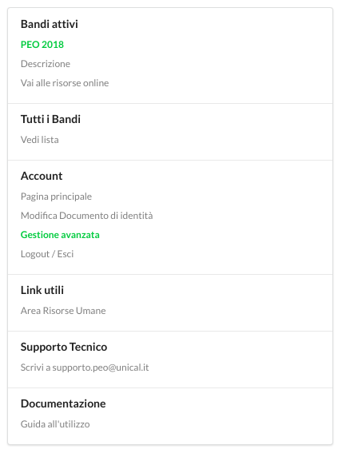

.. Procedura Elettronica Online (PEO) documentation master file, created by
   sphinx-quickstart on Tue Sep 11 08:57:06 2018.
   You can adapt this file completely to your liking, but it should at least
   contain the root `toctree` directive.

Il menu
=======

Il menu laterale fornisce un rapido accesso alle principali sezioni della piattaforma.

**Bandi attivi**: 
Permette all'utente di consultare i dettagli dei bandi attualmente attivi e di accedere rapidamente alle risorse online (documentazione, regolamenti e altro).

**Tutti i bandi**: 
L'elenco di tutti i bandi attivati sulla piattaforma nel corso del tempo.

**Account**: 
Contiene le funzioni per la gestione dell'account utente (*Pagina principale* per tornare alla dashboard e consultare le proprie informazioni personali, *Modifica documento d'identità* per la gestione del documento obbligatorio, *Gestione avanzata* riservata agli utenti amministratori, *Logout/Esci* per terminare la sessione corrente) 

**Link utili**: 
Per raggiungere agevolmente risorse di particolare interesse

**Supporto Tecnico**: 
Utile nel caso in cui si verificassero malfunzionamenti della piattaforma o semplicemente per l'assistenza nell'utilizzo delle procedure

**Documentazione**: 
Il link alla documentazione ufficiale di *peo.unical.it*

