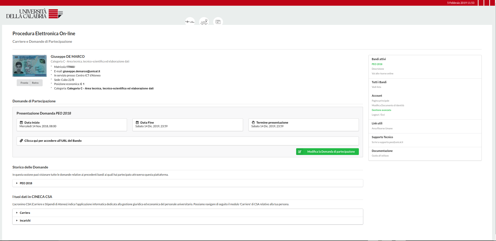
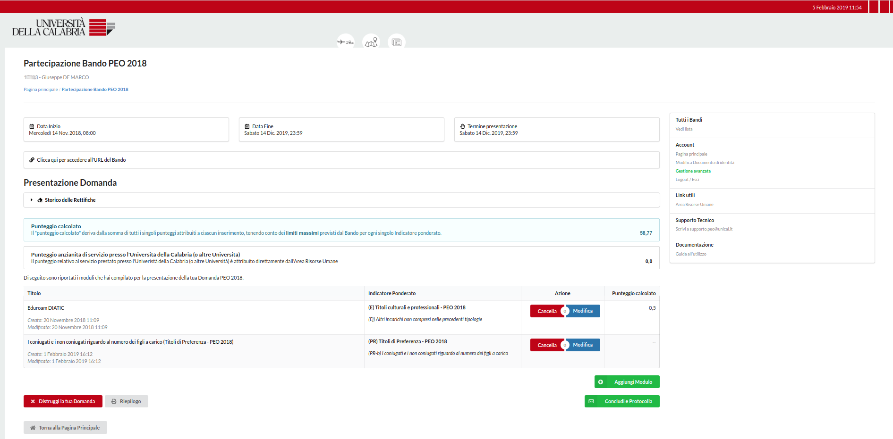
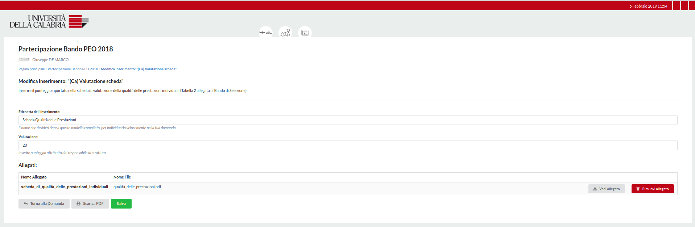
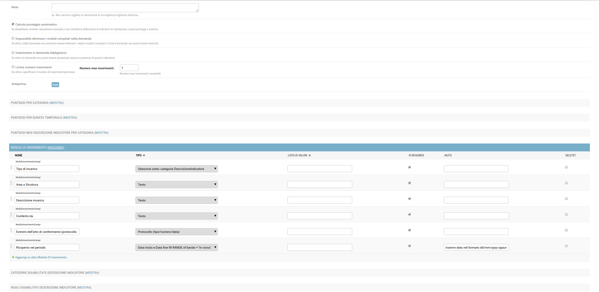

PEO - Procedura elettronica On-line
-----------------------------------

La piattaforma peo.unical.it è il sistema sviluppato dall’Università della Calabria per informatizzare la gestione dei Bandi e delle procedure di valutazione del personale.
Gli utenti possono compilare i moduli di partecipazione in corrispondenza dell’apertura di una procedura elettronica di valutazione e selezione, quale il bando PEO.
Il sistema consente di:

- Interfacciarsi a CINECA CSA mediante connessione su DB nativa (con cache locale) oppure mediante uno script personalizzato di replica dati (SQL);
- Protocollare mediante WebService;
- Autenticare mediante SSO (Saml2) i partecipanti;
- Costruire Moduli di inserimento dati via Admin backend;

La piattaforma è composta da diversi moduli indipendenti e da due interfacce:

- Frontend, dedicato agli utenti partecipanti;
- Backend, dedicato agli utenti staff e amministratori, ovvero coloro i quali configureranno i bandi e valuteranno i moduli protocollati dai partecipanti;

Galleria
--------

_**Frontend**: Schermata della Home_


_**Frontend**: Un esempio di domanda_


_**Frontend**: Un modulo di inserimento con allegato_


_**Backend**: Interfaccia per la costruzione dinamica dei moduli, per ogni Descrizione di Indicatore Ponderato_


Requirements
------------

````
sudo apt install python3-dev ipython3 python3-pip python3-setuptools mariadb-server libmariadbclient-dev-compat xmlsec1

# if mysql
sudo apt install mysql-server libmysqlclient-dev
````

#### WKHTMLTOPDF

Questo componente consente di esportare le domande in formato PDF è quindi necessario per le funzioni di download e protocollazione.
Installando i pacchetti Debian manca il supporto headless e in produzione sul server wkhtmltopdf torna eccezione se manca DISPLAY:0.

Bisogna installarlo da repository dev (testato su Debian9) o da sorgenti.

````
wget https://downloads.wkhtmltopdf.org/0.12/0.12.5/wkhtmltox_0.12.5-1.stretch_amd64.deb

sudo dpkg -i wkhtmltox_0.12.5-1.stretch_amd64.deb
sudo apt install -f
````

Setup
-----

````
virtualenv -p python3 django_peo.env
source django_peo.env/bin/activate

git clone https://github.com/UniversitaDellaCalabria/PEO.git
cd PEO
# then clone repo and enter in its folder
pip3 install -r requirements
````

In seguito dovrai:

- rinominare django_peo/settingslocal.py.example in settingslocal.py e apportare qui le tue modifiche;
- controllare che la connessione a CINECA CSA funzioni
- configurare il modello di replica di CSA se 'native' o 'replica' in django_peo/settings.py

Cineca CSA
----------

#### Oracle dblink setup
Scarica il client Oracle e installalo come utente root:
````
unzip SETUP/ORACLE_Setup/instantclient-basic-linux.x64-12.2.0.1.0.zip -d /opt/oracle
echo "/opt/oracle/instantclient_12_2" > /etc/ld.so.conf.d/oracle-instantclient1.conf
ldconfig

````
Per personalizzare le colonne delle tabelle/viste provenienti da CINECA CSA
bisogna ereditare l'app csa o modificarne il contenuto in csa.models.py.

I dati da CSA possono essere usati in due modi, lettura diretta (con cache)
oppure copia dati su tabelle locali. Consultare django_peo/settings.py
per gli esempi di configurazione.

#### Nota su CINECA CSA

Il sistema PEO non dipende da CINECA CSA ma usa questo per allineare i dati.
Questo significa che puoi allineare/creare/gestire i tuoi dati come meglio preferisci.
Ti conviene mantenere la struttura del modello dati così come esposto in csa/models.py
per evitare di dover apporre modifiche.

Se le colonne del tuo DB dovessero chiamarsi diversamente rispetto a CSA, puoi modificare il
mapping in csa/models.py, modifica solo i valori e non le chiavi per garantire il funzionamento del codice:

````
CARRIERA_FIELDS_MAP = {'descr_aff_org': 'ds_aff_org',
                       'descr_sede':    'ds_sede',
                       'descr_inquadramento': 'ds_inquadr',
                       'descr_profilo':       'ds_profilo',
                       'attivita':      'attivita',
                       'data_inizio_rapporto': 'dt_rap_ini',
                       'data_inizio':   'dt_ini',
                       'data_fine':     'dt_fin',
                       'inquadramento': 'inquadr',
                       'ruolo': 'ruolo'}

# per i docenti invence rimuoviamo gli attributi inutili e aggiungiamo quelli specifici
CARRIERA_DOCENTE_FIELDS_MAP = CARRIERA_FIELDS_MAP.copy()
del CARRIERA_DOCENTE_FIELDS_MAP['descr_profilo']
CARRIERA_DOCENTE_FIELDS_MAP.update({"aff_org": "aff_org",
                                    "ds_ruolo": "ds_ruolo",
                                    "ds_attivita": "ds_attivita",
                                    "dt_avanz" : "dt_avanz",
                                    "dt_prox_avanz" : "dt_prox_avanz",
                                    "cd_sett_concors" : "cd_sett_concors",
                                    "ds_sett_concors" : "ds_sett_concors",
                                    "cd_ssd" : "cd_ssd",
                                    "ds_ssd" : "ds_ssd",
                                    "area_ssd" : "area_ssd",
                                    "ds_area_ssd" : "ds_area_ssd",
                                    "scatti" : "scatti",
                                    "inquadramento": "inquadr",
                                    "descr_inquadramento": "ds_inquadr"})

INCARICHI_FIELDS_MAP = {'data_doc': 'data_doc',
                        'num_doc': 'num_doc',
                        'tipo_doc': 'tipo_doc',
                        'descr_tipo': 'des_tipo',
                        'data_inizio':   'dt_ini',
                        'data_fine':     'dt_fin',
                        #'relaz_accomp': 'relaz_accomp',
                        'ruolo': 'ruolo'}
````

DB setup
--------

````
export USER='username del db in settingslocal.py'
export PASS='la password configurata in settingslocal.py'
export HOST='host del db in settingslocal.py'
export DB='db name in settingslocal.py'

mysql -u root -e "\
CREATE USER IF NOT EXISTS ${USER}@'${HOST}' IDENTIFIED BY '${PASS}';\
CREATE DATABASE ${DB} CHARACTER SET utf8 COLLATE utf8_general_ci;\
GRANT ALL PRIVILEGES ON ${DB}.* TO ${USER}@'${HOST}';"
````

Popolamento iniziale dei dati
-----------------------------
E' possibile precaricare le seguenti definizioni, mediante il comando:

`bash loaddatas.sh`

Questo caricherà nel DB Peo i seguenti:

- gestione_risorse_umane/posizioni_economiche (deprecabile);
- gestione_risorse_umane/tipo_contratto;
- gestione_risorse_umane/tipo_invalidita;
- un bando di esempio;

Molto probabilmente non ne avrai bisogno e in futuro questo script verrà rimosso.

Primo accesso al sistema
------------------------
````
./manage.py createsuperuser
./manage.py makemigrations # (se CSA replica le migrations rimangono private)
./manage migrate
./manage.py runserver
````

DB Backup
---------

````
# exclude auth.permission and contenttypes per evitare integrity errors on previously migrated db
./manage.py dumpdata --exclude auth.permission --exclude contenttypes > db.json
````

Hai inoltre uno script che esegue il backup crittografato in formato json e SQL.
Questo script utilizza le credenziali del DB che hai configurato in settingslocal.py.
Di default questo salva i dump in /opt/django_peo_dumps.
````
bash uwsgi_setup/dump_db_json_7z.sh
````

Rebuild con migrations rebased
------------------------------

````
mysql -u root -e "DROP DATABASE $DB;"

mysql -u root -e "\
CREATE DATABASE ${DB} CHARACTER SET utf8 COLLATE utf8_general_ci;\
GRANT ALL PRIVILEGES ON ${DB}.* TO ${USER}@'${HOST}';"

find . -type f | grep ".pyc" | xargs rm

./manage.py makemigrations
./manage.py migrate
bash loaddatas.sh 
````

Integrazione Protocollo ArchiPRO
--------------------------------
il client di riferimento è una app installata separatamente.
I template che utilizzerai per la generazione dei file XML che descrivono in flusso li puoi copiare/modificare in
protocollo_ws/cml_templates.

E' possibile customizzare il client in settings.py
ereditando una Classe come Base

````
# quale classe utilizzare per instanziare un oggetto, può dunque essere customizzato
CLASSE_PROTOCOLLO = 'protocollo_ws.protocollo'
````

Setup SAML2
-----------
PEO utilizza pysaml2 per semplificare la produzione di un SAML2 SP.
Questo non comporta alcuna patch del webserver o modulo aggiuntivo di questo ma
solo la corretta definizione della sua configurazione nel file django_peo/sp_pysaml2_shibidp.py.

Abbiamo lasciato invariato il file, con tanto di commenti, per facilitarne la comprensione.
Puoi configurare una configurazione diversa o più di una (se test/produzione o altro) e puntare a questa
nel file django_peo/settings.py come segue:

````
if 'djangosaml2'  in INSTALLED_APPS:
    # from . import sp_pysaml2
    from . import sp_pysaml2_shibidp as sp_pysaml2
    
    # pySAML2 SP mandatory
    # SESSION_EXPIRE_AT_BROWSER_CLOSE=True
    
    AUTHENTICATION_BACKENDS = (
        'django.contrib.auth.backends.ModelBackend',
        'djangosaml2.backends.Saml2Backend',
    )
    
    LOGIN_URL = '/saml2/login/'
    LOGOUT_URL = '/logout/'
    LOGIN_REDIRECT_URL = '/'
    LOGOUT_REDIRECT_URL = '/'

    BASE_URL = sp_pysaml2.BASE_URL

    # OR NAME_ID or MAIN_ATTRIBUTE (not together!)
    # SAML_USE_NAME_ID_AS_USERNAME = sp_pysaml2.SAML_USE_NAME_ID_AS_USERNAME 
    SAML_DJANGO_USER_MAIN_ATTRIBUTE = sp_pysaml2.SAML_DJANGO_USER_MAIN_ATTRIBUTE
    SAML_DJANGO_USER_MAIN_ATTRIBUTE_LOOKUP = sp_pysaml2.SAML_DJANGO_USER_MAIN_ATTRIBUTE_LOOKUP

    SAML_CREATE_UNKNOWN_USER = sp_pysaml2.SAML_CREATE_UNKNOWN_USER
    SAML_CONFIG = sp_pysaml2.SAML_CONFIG
    SAML_ATTRIBUTE_MAPPING = sp_pysaml2.SAML_ATTRIBUTE_MAPPING
````

Si rimanda alla documentazione di [djangosaml2](https://github.com/knaperek/djangosaml2) e [pySAML2](https://github.com/IdentityPython/pysaml2) per ulteriori considerazioni.

Setup messa in produzione
-------------------------

Consultare uwsgi_setup folder per gli esempi comuni di configurazione.

````
apt update && apt upgrade -y
apt install nginx python3 python3-dev python3-pip python3-setuptools

pip3 install uwsgi

# populate data/static folder, according to settings.STATIC_ROOT 
./manage.py collectstatic
# 118 static files copied to './django_peo/data/static'.
````

cron scripts
````
# crontab rules

# django per csa sync
52 0 * * * peo_user /opt/django_peo/uwsgi_setup/csa_sync.sh

# django peo encrypted dumps
0 0 * * * peo_user /opt/django_peo/uwsgi_setup/dump_db_json_aes.sh

# django peo media files sync
0 10 * * * peo_user rsync -avu --delete /opt/django_peo/data/media /opt/django_peo_dumps/media

````

Migrazione dati denominazioni PeoDynamicForm fields
---------------------------------------------------
**Solo per sviluppatori**

Nuove denominazioni dei field con 'name' statico contenuti in PEO 2018
````
data_inizio# : data_inizio_dyn_inner
data_fine# : data_fine_dyn_inner
fino_ad_oggi# : in_corso_dyn
data_inizio_# : data_inizio_dyn_out
data_fine_# : data_fine_dyn_out
tipo_numerazione : tipo_numerazione_dyn
numero_protocollo : numero_protocollo_dyn
data_protocollo : data_protocollo_dyn
punteggio : punteggio_dyn

````

Field con 'name' statico (in PEO 2018) che diventano dinamici.
(Controllo sui form di ogni DescrizioneIndicatore per rilevare il nuovo slug).
````
anno_in_range_of_carriera : anno_pubblicazione (presente in PEO 2018 solo in Ea)
data_lower_than_bando : slug dinamico da definizione field (campo mai utilizzato in PEO 2018)

````

Denominazioni rimaste invariate
````
durata_come_intero : durata_come_intero
sub_descrizione_indicatore : sub_descrizione_indicatore
domanda_bando_id : domanda_bando_id
titolo_di_studio_superiore : titolo_di_studio_superiore

````

Procedura di migrazione delle denominazioni
````
from domande_peo.models import *
from gestione_peo.models import *
bando = Bando.objects.filter(slug="peo-2018").first()
domande = DomandaBando.objects.filter(bando=bando).all()
for domanda in domande:
    print(domanda.dipendente)
    for mdb in domanda.modulodomandabando_set.all():
        mdb.migrate_fieldname('data_inizio#', 'data_inizio_dyn_inner')
        mdb.migrate_fieldname('data_fine#', 'data_fine_dyn_inner')
        mdb.migrate_fieldname('fino_ad_oggi#', 'in_corso_dyn')
        mdb.migrate_fieldname('data_inizio_#', 'data_inizio_dyn_out')
        mdb.migrate_fieldname('data_fine_#', 'data_fine_dyn_out')
        mdb.migrate_fieldname('tipo_numerazione', 'tipo_numerazione_dyn')
        mdb.migrate_fieldname('numero_protocollo', 'numero_protocollo_dyn')
        mdb.migrate_fieldname('data_protocollo', 'data_protocollo_dyn')
        mdb.migrate_fieldname('punteggio', 'punteggio_dyn')
        mdb.migrate_fieldname('anno_in_range_of_carriera', 'anno_pubblicazione')
````
        
Update tabella 'gestione_peo.moduloinserimentocampi'.
````
mod_ins_campi_migration_dict = {
    'CharField' : 'CustomCharField',
    'TextField' : 'TextAreaField',
    'IntegerField' : 'PositiveIntegerField',
    'FloatField' : 'PositiveFloatField',
    'PunteggioFloatField' : 'PunteggioFloatField',
    '_TitoloStudioField' : 'TitoloStudioField',
    '_SubDescrizioneIndicatoreField' : 'SubDescrizioneIndicatoreField',
    'FileField' : 'CustomFileField',
    'CheckBoxField' : 'CheckBoxField',
    'CustomSelectBoxField' : 'CustomSelectBoxField',
    'CustomRadioBoxField' : 'CustomRadioBoxField',
    'ProtocolloField' : 'ProtocolloField',
    'DateField' : 'BaseDateField',
    'StartEndDateField' : 'DateInRangeInCorsoComplexField',
    'StartEndDateField_2' : 'DateInRangeComplexField',
    'OutStartEndDateField' : 'DateOutOfRangeComplexField',
    'DataLowerThanBandoField' : 'DataLowerThanBandoField',
    'AnnoInRangeOfCarrieraField' : 'AnnoInRangeOfCarrieraField',
    'DurataComeInteroField' : 'DurataComeInteroField',
}

for i in mod_ins_campi_migration_dict:
    c = ModuloInserimentoCampi.objects.filter(tipo = i)
    #print(i, c)
    c.update(tipo = mod_ins_campi_migration_dict[i])

````

Procedura di test per rilevare incongruenze in seguito alla migrazione.
````
from domande_peo.models import *
from gestione_peo.models import *
bando = Bando.objects.filter(slug = "peo-2018").first()
domande = DomandaBando.objects.filter(bando = bando).all()
for domanda in domande:
    print(domanda.dipendente)
    for mdb in domanda.modulodomandabando_set.filter(disabilita = False):
        try:
            form = mdb.compiled_form()
            if not mdb.allegati_validi() or not form.is_valid():
                print("Domanda PEO", domanda)
                print("Modulo non valido")
                print("Denominazione", mdb)
                print("ID", mdb.id)
                print()
        except Exception as e:
            print("Eccezione {}".format(e), mdb.id, domanda.dipendente)
            continue
````

Installazione Sphinx (solo development)
---------------------------------------
Sphinx serve per la produzione della documentazione della piattaforma.

````
sphinx-quickstart Documentazione

Separate source and build directories (y/n) [n]: y
Name prefix for templates and static dir [_]: peo_
Project name: Procedura Elettronica Online (PEO)
Author name(s): Giuseppe De Marco, Francesco Filicetti
Project release []: 1.0
Project language [en]: it
Source file suffix [.rst]: .rst
Name of your master document (without suffix) [index]: 
Do you want to use the epub builder (y/n) [n]: y
autodoc: automatically insert docstrings from modules (y/n) [n]: y
doctest: automatically test code snippets in doctest blocks (y/n) [n]: n
intersphinx: link between Sphinx documentation of different projects (y/n) [n]: n
todo: write "todo" entries that can be shown or hidden on build (y/n) [n]: y
coverage: checks for documentation coverage (y/n) [n]: n
imgmath: include math, rendered as PNG or SVG images (y/n) [n]: 
mathjax: include math, rendered in the browser by MathJax (y/n) [n]: 
ifconfig: conditional inclusion of content based on config values (y/n) [n]: y
viewcode: include links to the source code of documented Python objects (y/n) [n]: y
githubpages: create .nojekyll file to publish the document on GitHub pages (y/n) [n]: n

Create Makefile? (y/n) [y]: y
Create Windows command file? (y/n) [y]: y
````
